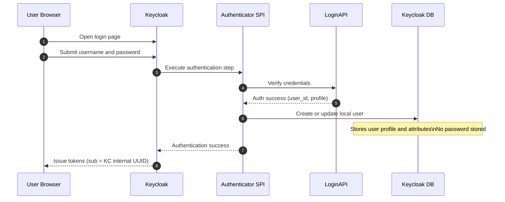
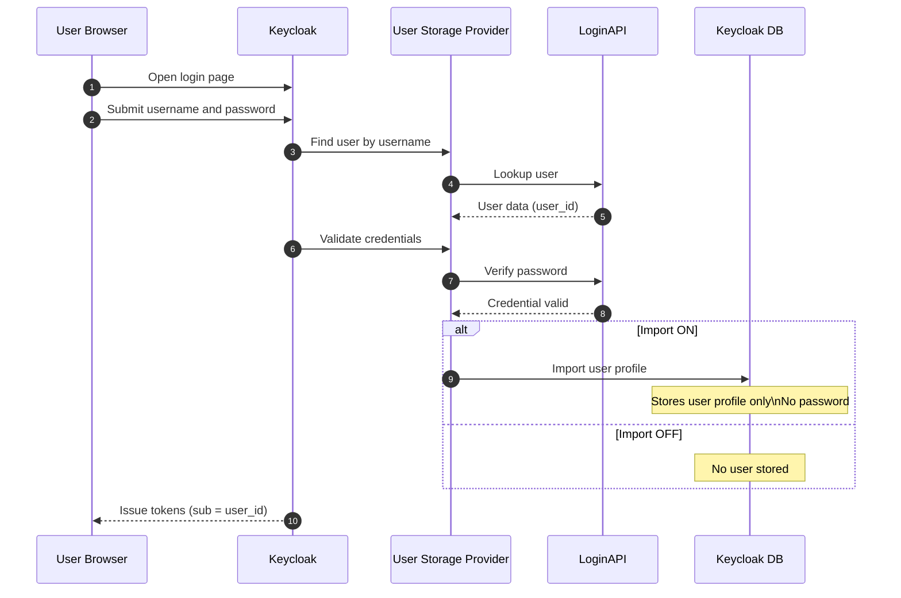

# Keycloak Bridge

This project integrates **Keycloak** as the central **OAuth2 / OpenID Connect (OIDC) provider** while delegating **user authentication** to an existing internal **LoginAPI** service.

The main objective is to standardize authentication, authorization, and token management across services **without migrating or duplicating user credentials into Keycloak**.  
Keycloak is responsible for OAuth2/OIDC flows, session management, token issuance, consent, and client configuration, while LoginAPI remains the **source of truth for user authentication**.

This architecture enables secure SSO, improves consistency across services, and provides a clear path for future extensions such as MFA, advanced policies, and external identity providers.

---

## ✨ Feature Goals

### Core Features
- Keycloak as OAuth2 / OIDC provider
- Authorization Code Flow support
- Refresh tokens and token rotation
- Token introspection and revocation
- Client scopes and protocol mappers
- Centralized SSO session management
- Configurable consent handling
### Authentication Integration
- Delegate credential verification to LoginAPI
- No password storage in Keycloak
- Support for custom authentication logic via SPI
- Just-in-time user provisioning (optional)
- Stable identity mapping between LoginAPI users and Keycloak users

### Security & Operations
- Short-lived access tokens
- Central logout and session invalidation
- Clear separation of responsibilities:
    - LoginAPI: authentication and user verification
    - Keycloak: authorization, tokens, sessions
- Ready for MFA and conditional authentication rules

## Target Goals

### Short-Term Goals
- Integrate Keycloak without changing existing LoginAPI behavior
- Enable OAuth2/OIDC for internal services
- Minimize migration effort and operational risk
- Keep the system simple and observable

### Mid-Term Goals
- Standardize token claims and scopes across services
- Introduce MFA and advanced authentication flows
- Improve admin visibility into users, sessions, and clients
- Strengthen security with monitoring and rate limiting

### Long-Term Goals
- Optionally evolve LoginAPI into a full external user directory
- Support multiple authentication sources if required
- Enable cross-product SSO at scale
- Maintain a clean, scalable, and extensible identity architecture


---

## Flow

### Option A — Authenticator SPI (LoginAPI validates credentials)

#### Pros

- Fastest to implement
- Keeps full OAuth2 / OIDC features of Keycloak
- LoginAPI remains source of truth for credentials
- Keycloak does NOT store passwords
- Simple mental model
- Works well with MFA, conditional flows, required actions
- Easy to migrate to Option B later

#### Cons

- Keycloak stores user profiles locally (shadow users)
- `sub` in JWT is Keycloak internal UUID
- External `user_id` must be added as a custom claim
- User lifecycle (disable/delete) may need syncing logic
- Keycloak Admin UI shows local users, not authoritative LoginAPI view
-



## Option B — User Federation / User Storage Provider (LoginAPI = user store)



#### Pros

- LoginAPI is the true user directory
- Can make `sub = LoginAPI.user_id`
- No passwords stored in Keycloak
- Cleaner long-term architecture for external identity
- Better alignment with LDAP / AD-like models
- Import ON gives better admin UX
- Import OFF avoids user data in Keycloak DB

#### Cons

- More complex to implement (user lookup + credential validation)
- Higher coupling to LoginAPI availability
- Import OFF limits admin search and user management
- Needs careful caching and performance tuning
- More SPI surface to maintain across Keycloak upgrades

### Quick Decision Guide

- Ship fast, OK with `sub != user_id`  
  → Option A

- `sub` must equal LoginAPI `user_id`  
  → Option B

- Avoid storing users in Keycloak DB  
  → Option B (Import OFF)

- Better admin UX, still external auth  
  → Option B (Import ON)

### Final

Option A = simpler, faster, Keycloak stores users, sub = KC UUID  
Option B = cleaner identity model, LoginAPI is user store, sub = user_id

## 🚀 Quick Start

### Prerequisites

- Docker (recommended)
- Java 25 (only if running without Docker)
- Maven 3.9+

---

### Run with Docker (recommended)

#### Default JVM mode

```bash
make compose-up
```

App runs at:

```
http://localhost:8080
```

Health check:

```
http://localhost:8080/actuator/health
```

---

### Run with Docker profiles

| Mode   | Command             | Port |
|--------|---------------------|------|
| JVM    | make compose-up     | 8080 |
| AOT    | make compose-aot    | 8081 |
| CDS    | make compose-cds    | 8082 |
| Native | make compose-native | 8083 |

Stop containers:

```bash
make compose-down
```

---

## 🐳 Docker Images

Build images directly:

```bash
make docker-build
make docker-build-aot
make docker-build-cds
make docker-build-native
```

Resulting images:

- spring-boot-template:latest
- spring-boot-template:aot
- spring-boot-template:cds
- spring-boot-template:native

---

## 🧪 Run Tests

```bash
mvn test
```

---

## 📁 Project Structure

```
.
├─ docker/
│  ├─ Dockerfile
│  ├─ Dockerfile.aot
│  ├─ Dockerfile.cds
│  ├─ Dockerfile.native
│  └─ docker-compose.yml
├─ src/
│  ├─ main/java
│  └─ test/java
├─ .github/workflows/ci.yml
├─ Makefile
├─ pom.xml
└─ README.md
```

---

## 🧩 Native Build Notes

- Native build is handled via Dockerfile.native
- No Lombok to avoid native/AOT issues
- Image name defaults to Maven artifactId

---

## 🛠️ Customization After Using Template

After clicking **Use this template**, you should:

1. Rename:
    - groupId
    - artifactId
    - package name
2. Update:
    - spring.application.name
    - Docker image name (if desired)
3. Add dependencies as needed:
    - JPA / Mongo
    - Security
    - Kafka / Redis
    - Observability

We can use the script to quickly rename:

```bash
chmod +x scripts/init-project.sh

./scripts/init-project.sh new-project-name
```

---

## 📌 Design Principles

- Minimal by default
- No opinionated libraries
- Docker-first
- Native-ready
- Easy to extend

---

## 📄 License

[MIT](LICENSE)
